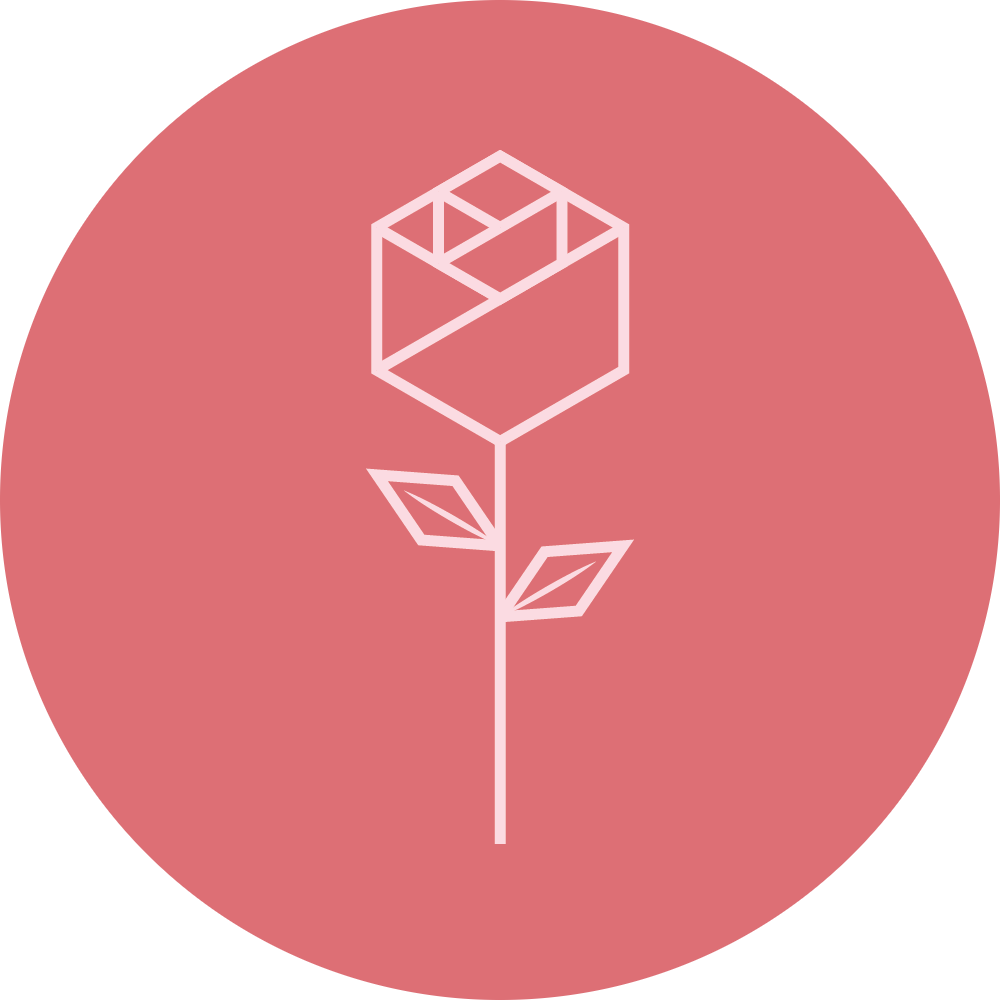

 

    

 

I'm Ryan and I like to code. Its that simple

I like Java, C, Python, PHP, *and HTML/CSS* (pretty much anything ive used before)

Im also a big fan of clean ui designs

##

Check out my brilliant file storage website [waterserver](https://waterserver.sytes.net/)
